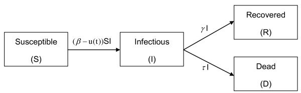
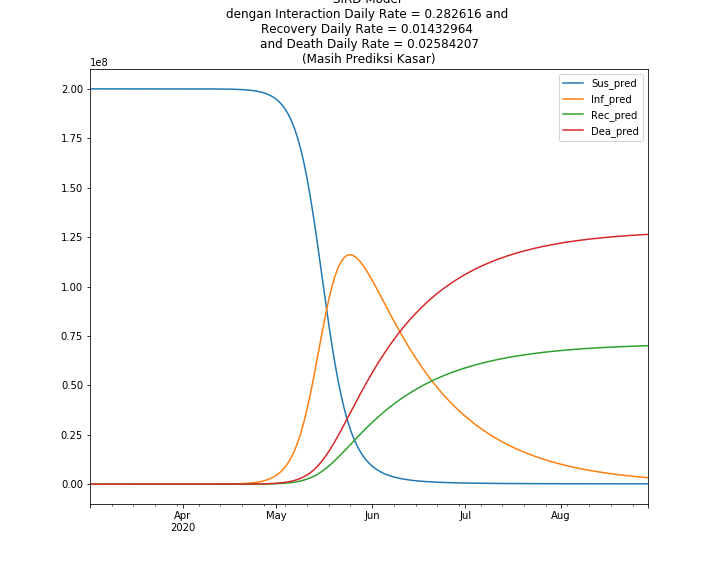
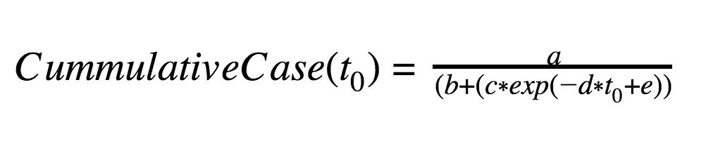
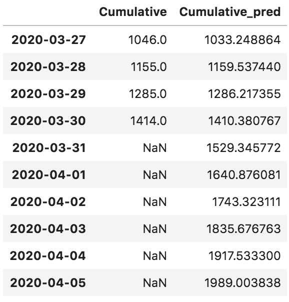
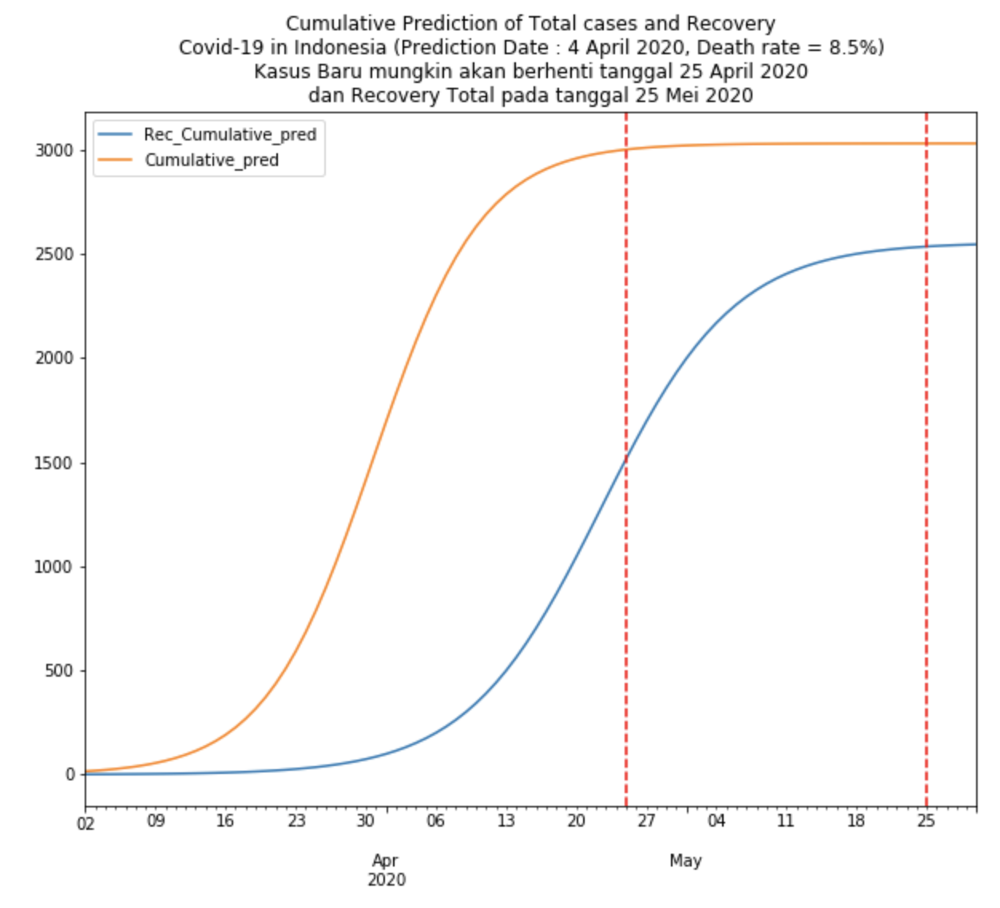
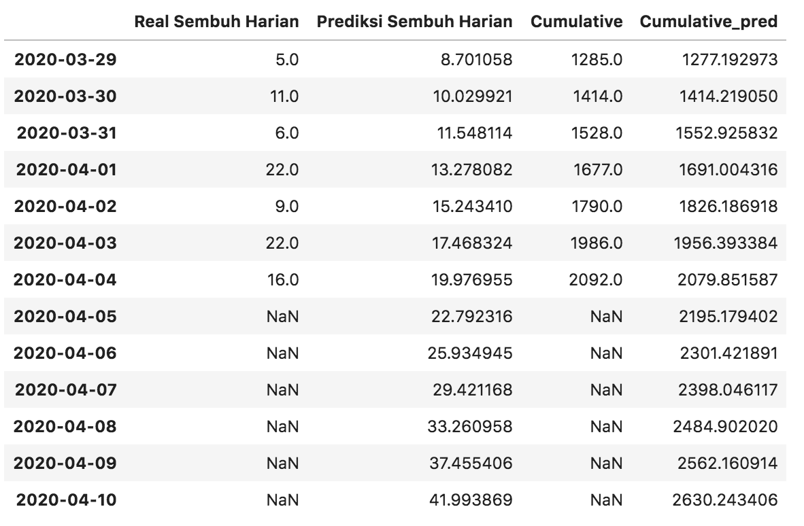
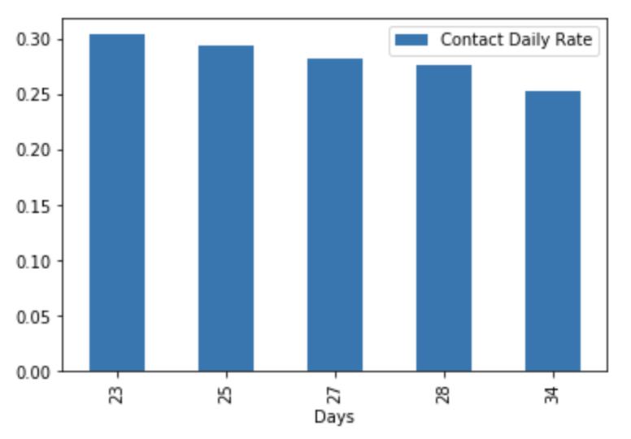
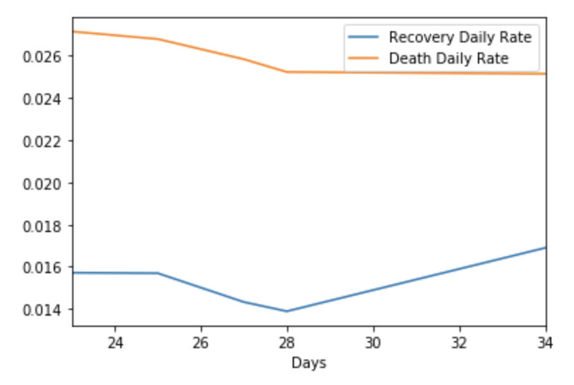

# Covid Modelling

Ini merupakan repositori untuk pemodelan penyebaran Covid di Indonesia. Analisa dilakukan dengan data yang terus di update dari tanggal 26 Maret - (_on going analysis_).

**Disclaimer** : Analysis dan Prediksi yang tertulis disini masih sangat kasar dan masih harus banyak direview. Jangan dulu jadikan ini sebagai patokan.

## Analysis

Analisa yang dilakukan menyesuaikan ketersediaan data yang ada. Data yang tersedia hanya data gabungan semua kasus COVID-19 setiap harinya di Indonesia. Terima kasih [kawalcovid19](https://kawalcovid19.id/) untuk menyediakan datanya. Analisa yang dilakukan akan lebih _Predictive Analysis_, analisa ini dilakukan untuk melihat bagaimana perkembangan COVID-19 di Indonesia kedepannya.

#### Update (2020/03/26)

Analisa dilakukan dengan melakukan fit-ing data yang tersedia dengan SIRD model. Model ini membutuhkan parameter yang sesuai sehingga SIRD akan bisa dipakai untuk memprediksi. 

Parameter SIRD masih mungkin untuk di estimasi dengan Regresi Linear dengan mengestimasi nilai turunan S,I,R, dan D terhadap waktu. Nilai turunan ini bisa didapat dengan mengurangi nilai dari salah satu `compartment value` tersebut di waktu `t` dan `t-1`

#### Update (2020/03/28)

Pendekatan dengan menggunakan Regresi Linear tidak memberikan hasil yang optimal. Untuk itu, Estimasi parameter dilakukan dengan mengoptimasi _cost function_ yang telah di definisikan. Sehingga estimasi parameter bisa dilakukan dengan _Bayes optimization_.

#### Update (2020/03/29)

Cukup memakan waktu lama untuk menemukan parameter yang sesuai dengan menggunakan _Bayes optimization_. Metode optimisasi tersebut juga harus masih diawasi dalam menemukan hasilnya (belum menemukan cara automasinya). Untuk itu dicoba menggunakan optimisasi lainnya, yaitu [_PSO Algorithm_](https://medium.com/analytics-vidhya/implementing-particle-swarm-optimization-pso-algorithm-in-python-9efc2eb179a6). Harapannya, optimisasi ini bisa membantu mencari parameter yang optimal untuk berbagai _case of data_ dalam fitting model SIRD ini.

Hasil dari tuning parameternya menunjukan adanya ketimpangan antara Recovery rate dan Death rate (Rr < Dr). Sebagai tambahan, Interaction rate antara `Suc` dan `Inf` mulai terlihat berkurang.. yang artinya banyak penduduk Indonesia yg melakukan Social Distancing (dan curve yg dikhawatirkan mulai menurun seharusnya). Pemerintah dan masyarakat harus terus berusaha agar Rumah sakit tidak penuh di akhir bulan Mei.
Prediction : kasus baru hari ini bisa mencapai hampir 200 .. 

#### Update (2020/03/31)
Turns out, it was 130 instead of 200. Sepertinya pendekatan SIRD masih kurang pas. Selanjutnya dicoba prediksi `Cumulative Case` dengan Logistic regression. 

Model ini memiliki 5 parameter (a,b,c,d,e) yang harus di estimasi menggunakan PSO.

berikut hasil prediksi

Prediksi 2020/03/31 sangat dekat dengan prediksi --> real case = 1528

#### Update (2020/04/05)

Prediksi Cumulative Cases mulai terlihat sangat under estimation saat prediksi data tanggal 3 April dimana real cases mencapai 1986 dan 4 April 2096 cases.
`Logistic Model `harus di perbaharui dan diprediksi ulang. Berikut hasilnya,

dengan prediksi harian beberapa hari kedepan sebagai berikut..

`SIRD Model` pun juga bisa diperbaharui dan dilihat perubahan parameternya. Yang ditunjukan disini hanya perubahan ratenya saja, bukan angka aslinya. Karena ditakutkan akan misleading untuk skarang. Disini terlihat `contact daily rate`-nya terus menurun, artinya kemungkinan orang yang terjangkit virus dan yang tidak untuk saling bersentuhan semakin kecil.

Perubahan terhadap `Death and Recovery rate`-nya juga mulai terlihat membaik dimana `Death rate` terlihat menurun, sedangkan `Recovery Rate` mulai meningkat.

## Refensi
    
[Data](https://kawalcovid19.blob.core.windows.net/viz/statistik_harian.html)

[Source Script](http://epirecip.es/epicookbook/chapters/kr08/2_1/python_original)
    
[Image 1](https://www.researchgate.net/figure/Scheme-of-Susceptible-Infectious-Recovered-Death-SIRD-Model-Boxes-represent_fig1_41507287)
    
[Image 2](https://www.chegg.com/homework-help/questions-and-answers/codes-problem-code-1-function-siddeterm-simulation-deterministic-sird-model-using-differen-q21316613)